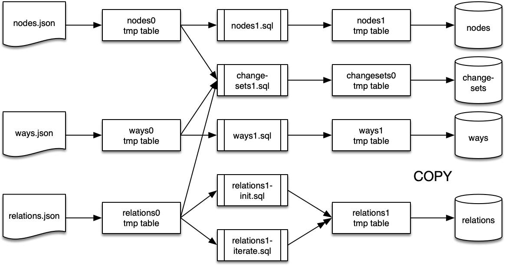

# Create phase0 tables

- CREATE nodes0.json
- CREATE ways0.json
- CREATE relations0.json
- CREATE changesets0.json

# Load JSON source data files

# Populate phase1 changesets table - aggregates of what changed when
- QUERY  changesets.sql (nodes0, ways0, relations0) => (changesets0)

# CREATE phase1 tables
- CREATE nodes1.json
- CREATE ways1.json
- CREATE relations1.json
- CREATE changesets1.json

# Populate phase1 nodes table, converting [lon,lat] to POINT
# Overwrite
- QUERY  nodes1.sql (nodes0) => (nodes1)

# Populate phase1 ways table, converting node[] to POLYGON or LINESTRING
# Overwrite
- QUERY  ways1.sql  (ways0)  => (ways1)

# Populate phase1 relations table
# Overwrite
- Populate with initial geometries that are UNION of:
  - nodes (POINTs)
  - ways (POLYGONs and LINESTRINGs)
  - ONLY do this for relations that have no subrelations `relations1_init.sql`

# Append
- Recursively populate next level of relation ancestors' geometries `relations1_iterate.sql`
- Terminate when no geometry-less relations exist

# Populate phase1 changesets table
- Grab bounding box corners for all changeset members
- Calculate the containing master bounding box

# COPY phase1 nodes      => FINAL nodes
# COPY phase1 ways       => FINAL ways
# COPY phase1 relations  => FINAL relations
# COPY phase1 changesets => FINAL changesets
